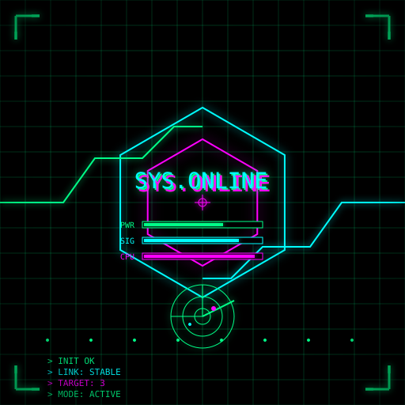

# pictlang

[](https://github.com/limloop/pictlang/actions/workflows/tests.yml)
[](LICENSE)
[](pyproject.toml)
[](https://pypi.org/project/pictlang/)
[](https://pypi.org/project/pictlang/)

Generate SVG images from a theme and style via an LLM-written Python DSL.

<table>
<tr>
<td align="center">
<br>
<sub>strict geometry, flat colors</sub>
</td>
<td align="center">
<br>
<sub>neon lines, glitch</sub>
</td>
<td align="center">
<br>
<sub>minimalism, 3 colors</sub>
</td>
</tr>
<tr>
<td align="center">
<br>
<sub>soft gradients, opacity</sub>
</td>
<td align="center">
<br>
<sub>white outline on deep blue</sub>
</td>
<td></td>
</tr>
</table>

<details>
<summary>🇷🇺 Русский</summary>

# pictlang

Генерирует SVG-изображения по теме и стилю через Python-DSL,
который пишет LLM.

## Что это

`pictlang` отправляет модели запрос с темой и стилем, получает
Python-функцию `render()` и исполняет её в песочнице. Функция
использует небольшой DSL для рисования, а не пишет SVG напрямую.
Результат — валидный SVG-файл.

Подход с DSL даёт три вещи:

- **Экономия токенов.** Сцена на DSL в 15–30 раз короче, чем та же
  сцена в чистом SVG. Циклы и функции сворачивают сотни
  повторяющихся элементов в несколько строк.
- **Валидация до исполнения.** Мы проверяем AST на «ровно один
  `render()`, без импортов, без side effects» **до** запуска.
- **Безопасность.** DSL — закрытый набор функций. Модель не может
  выдать `<script>` или внешние ссылки.

Подробности — в [`docs/architecture.md`](docs/architecture.md).

## Установка

```
pip install pictlang
```

Опциональные зависимости:

```
pip install "pictlang[optimize]"   # scour для оптимизации SVG
pip install "pictlang[socks]"      # поддержка SOCKS5-прокси
pip install "pictlang[all]"        # всё сразу
```

## Быстрый старт

Создайте конфиг и впишите свой API-ключ:

```
pictlang init --global
# отредактируйте ~/.config/pictlang/config.json
```

Сгенерируйте картинку:

```
pictlang "lighthouse in the fog" --style "minimalism, three colors"
```

## Пример вывода

```
UUID: 550e8400-e29b-41d4-a716-446655440000
SVG:  generated/valid/svg/550e8400-....svg
PY:   generated/valid/py/550e8400-....py
META: generated/valid/meta/550e8400-....json
```

UUID печатается в конце — по нему можно найти файлы позже.

## CLI

| Флаг | Что делает |
|---|---|
| `THEME` | Что рисовать (позиционный аргумент) |
| `--style STYLE` | Как рисовать (обязателен) |
| `--save valid\|all\|py\|svg` | Что сохранять (по умолчанию `valid`) |
| `--optimize` / `--no-optimize` | Включить/выключить оптимизацию SVG |
| `--optimizer auto\|scour\|svgo` | Какой оптимизатор использовать |
| `--keep-original` | Сохранить SVG до оптимизации |
| `--model NAME` | Переопределить модель |
| `--base-url URL` | Переопределить endpoint |
| `--proxy URL` | Прокси (http/https/socks5) |
| `--config PATH` | Путь к конфигу |
| `--check` | Проверить конфиг и соединение с API |

Отдельные команды:

| Команда | Что делает |
|---|---|
| `pictlang init [--global] [--path]` | Создать шаблон конфига |
| `pictlang render [uuid] [--force]` | Перегенерировать SVG из `.py` без обращения к API |

## Конфигурация

`pictlang` читает конфиг из:

1. `--config PATH`, если задан.
2. `./pictlang.json` в текущей директории.
3. Пользовательской директории:
   - Linux: `~/.config/pictlang/config.json`
   - macOS: `~/Library/Application Support/pictlang/config.json`
   - Windows: `%APPDATA%\limloop\pictlang\config.json`
4. Встроенных значений по умолчанию.

Пример — в [`pictlang.json.example`](pictlang.json.example).

## Документация

- [`docs/dsl.md`](docs/dsl.md) — полный справочник по DSL.
- [`docs/architecture.md`](docs/architecture.md) — как устроен pipeline.
- [`docs/prompt.md`](docs/prompt.md) — как писать свои промпты.

## Разработка

```
git clone https://github.com/limloop/pictlang.git
cd pictlang
pip install -e ".[dev]"
pytest
```

## Лицензия

Apache 2.0. См. [`LICENSE`](LICENSE).

</details>

---

<details open>
<summary>🇬🇧 English</summary>

# pictlang

Generate SVG images from a theme and style via an LLM-written Python DSL.

## What it is

`pictlang` sends a theme and a style to a model, receives a Python
function `render()`, and runs it in a sandbox. The function uses a
small drawing DSL instead of writing SVG directly. The result is a
valid SVG file.

The DSL approach gives three things:

- **Token efficiency.** A scene in the DSL is 15–30× shorter than the
  same scene in raw SVG. Loops and functions collapse hundreds of
  repeated elements into a few lines.
- **Validation before execution.** We check the AST for "exactly one
  `render()`, no imports, no side effects" **before** running anything.
- **Safety.** The DSL is a closed set of functions. The model cannot
  emit `<script>` or external references.

See [`docs/architecture.md`](docs/architecture.md) for details.

## Install

```
pip install pictlang
```

Optional extras:

```
pip install "pictlang[optimize]"   # scour for SVG optimization
pip install "pictlang[socks]"      # SOCKS5 proxy support
pip install "pictlang[all]"        # everything
```

## Quick start

Create a config and set your API key:

```
pictlang init --global
# edit ~/.config/pictlang/config.json
```

Generate an image:

```
pictlang "lighthouse in the fog" --style "minimalism, three colors"
```

## Example output

```
UUID: 550e8400-e29b-41d4-a716-446655440000
SVG:  generated/valid/svg/550e8400-....svg
PY:   generated/valid/py/550e8400-....py
META: generated/valid/meta/550e8400-....json
```

The UUID is printed at the end — use it to find the files later.

## CLI

| Flag | What it does |
|---|---|
| `THEME` | What to draw (positional) |
| `--style STYLE` | How to draw it (required) |
| `--save valid\|all\|py\|svg` | What to persist (default `valid`) |
| `--optimize` / `--no-optimize` | Enable/disable SVG optimization |
| `--optimizer auto\|scour\|svgo` | Which optimizer to use |
| `--keep-original` | Save the SVG before optimization |
| `--model NAME` | Override the model |
| `--base-url URL` | Override the endpoint |
| `--proxy URL` | Proxy (http/https/socks5) |
| `--config PATH` | Path to a config file |
| `--check` | Validate config and test API connectivity |

Subcommands:

| Command | What it does |
|---|---|
| `pictlang init [--global] [--path]` | Write a template config |
| `pictlang render [uuid] [--force]` | Re-render `.svg` from `.py` without calling the API |

## Configuration

`pictlang` reads configuration from:

1. `--config PATH`, if given.
2. `./pictlang.json` in the current directory.
3. The platform user-config directory:
   - Linux: `~/.config/pictlang/config.json`
   - macOS: `~/Library/Application Support/pictlang/config.json`
   - Windows: `%APPDATA%\limloop\pictlang\config.json`
4. Built-in defaults.

See [`pictlang.json.example`](pictlang.json.example) for a template.

## Documentation

- [`docs/dsl.md`](docs/dsl.md) — full DSL reference.
- [`docs/architecture.md`](docs/architecture.md) — how the pipeline works.
- [`docs/prompt.md`](docs/prompt.md) — how to write custom prompts.

## Development

```
git clone https://github.com/limloop/pictlang.git
cd pictlang
pip install -e ".[dev]"
pytest
```

## License

Apache 2.0. See [`LICENSE`](LICENSE).

</details>